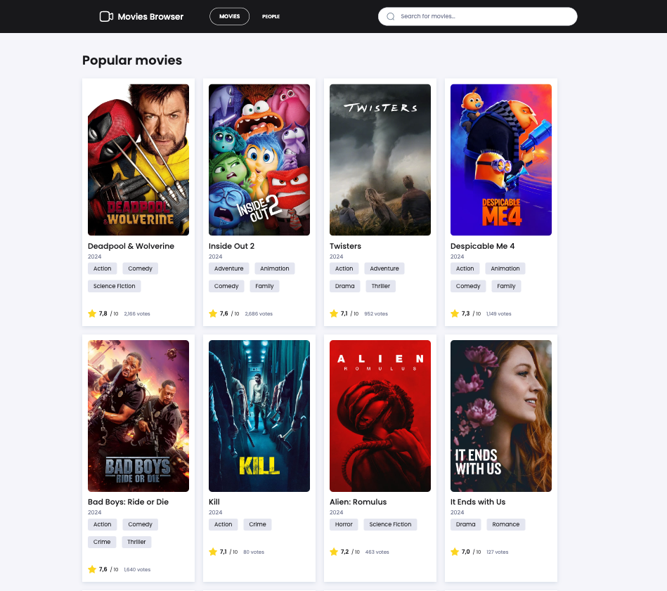
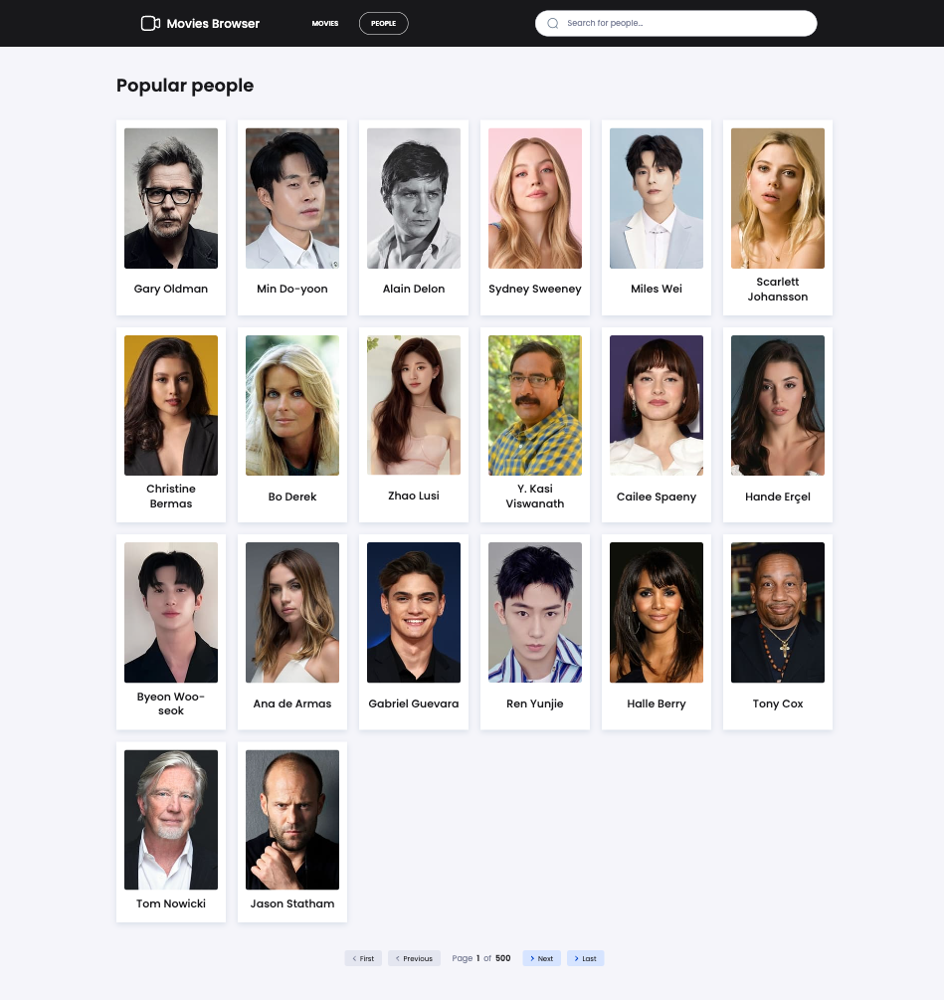
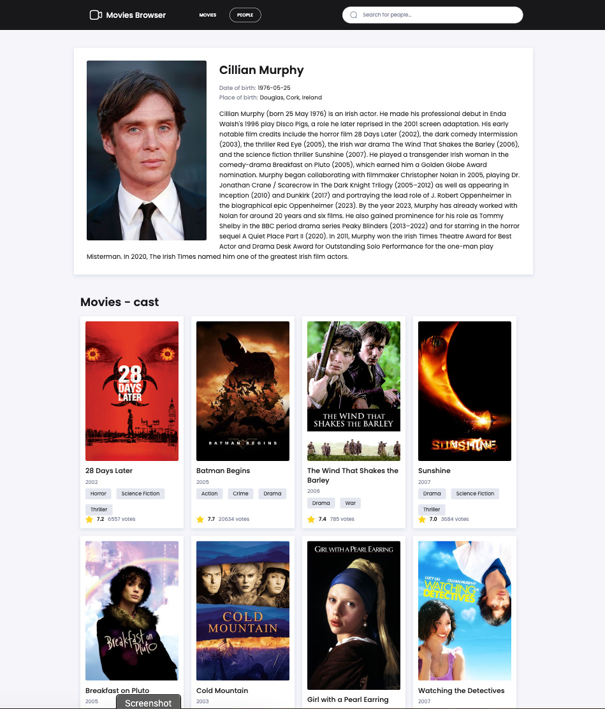
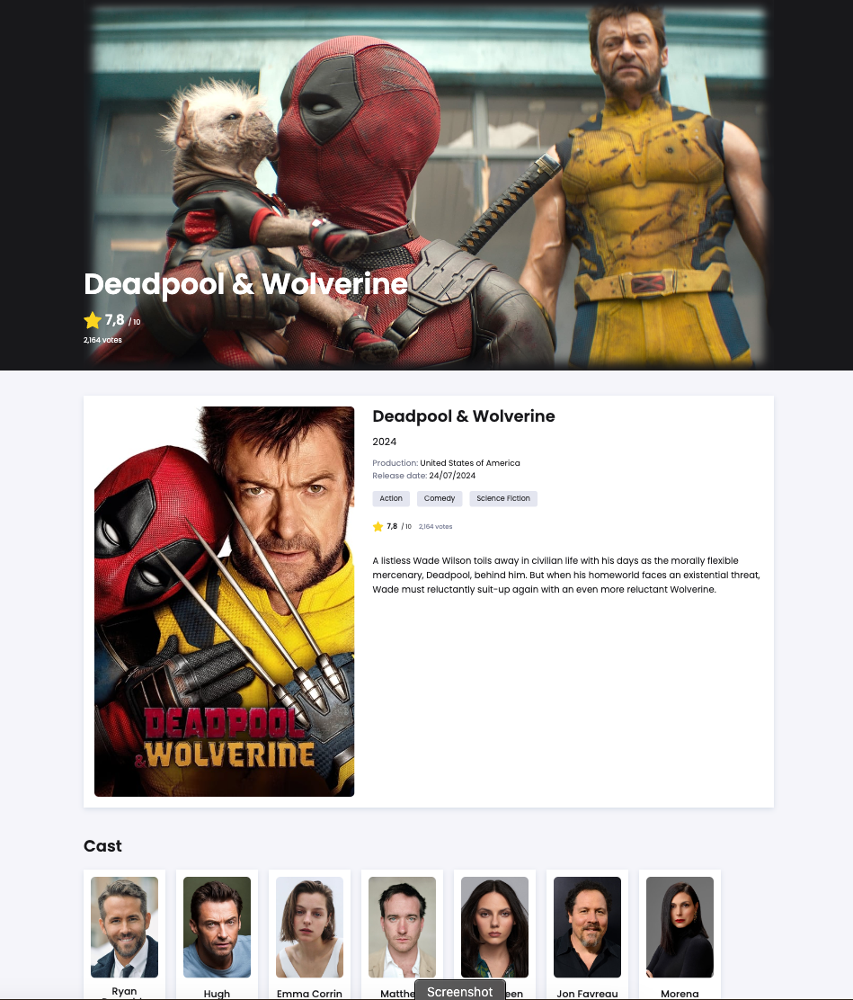

# Movies Browser

## Demo

Check out the live demo of the application here:
https://maxfadet.github.io/movies-browser/

## Description:

Discover and organize your favorite films effortlessly. 
Access detailed information, ratings, and reviews all in one place. 
Enjoy a smooth and intuitive experience with modern React technology.

This project was bootstrapped with [Create React App](https://github.com/facebook/create-react-app).

The application features a clean and responsive UI, powered by `styled-components`, with dynamic routing handled by `React Router` and state management achieved through `Redux` and `Redux-Saga`. The application is styled using a theme, allowing for consistent design across all components.

## Screenshots

Here are some screenshots of the project in action:

## Features

- **Movie Search**: Browse and search for movies by title, genre, or year.
- **Movie Details**: Click on any movie to view its detailed information, including a synopsis, rating, genre, and more.
- **Responsive Design**: Fully responsive UI, optimized for both desktop and mobile devices.
- **Dynamic Routing**: Navigation between pages using `React Router` with `NavLink` for active link styling.
- **Global State Management**: Managed through `Redux`, with asynchronous actions handled by `Redux-Saga`.
- **Theming**: Consistent styling across the application using `styled-components` and a global theme.
- **Error Handling**: Graceful handling of errors with user-friendly messages.

## Tech Stack

- **React**: Frontend library for building user interfaces.
- **Styled-Components**: For styling components with a clean, scoped CSS.
- **React Router (NavLink)**: For dynamic routing within the application.
- **Redux**: Global state management.
- **Redux-Saga**: Handling side effects and asynchronous actions.
- **ThemeProvider**: For consistent theming across the application.

## Available Scripts

In the project directory, you can run:

### `npm start`

Runs the app in the development mode.\
Open [http://localhost:3000](http://localhost:3000) to view it in your browser.

The page will reload when you make changes.\
You may also see any lint errors in the console.

### `npm run build`

Builds the app for production to the `build` folder.\
It correctly bundles React in production mode and optimizes the build for the best performance.

The build is minified and the filenames include the hashes.\
Your app is ready to be deployed!

See the section about [deployment](https://facebook.github.io/create-react-app/docs/deployment) for more information.

### `npm run eject`

**Note: this is a one-way operation. Once you `eject`, you can't go back!**

If you aren't satisfied with the build tool and configuration choices, you can `eject` at any time. This command will remove the single build dependency from your project.

Instead, it will copy all the configuration files and the transitive dependencies (webpack, Babel, ESLint, etc) right into your project so you have full control over them. All of the commands except `eject` will still work, but they will point to the copied scripts so you can tweak them. At this point you're on your own.

You don't have to ever use `eject`. The curated feature set is suitable for small and middle deployments, and you shouldn't feel obligated to use this feature. However we understand that this tool wouldn't be useful if you couldn't customize it when you are ready for it.